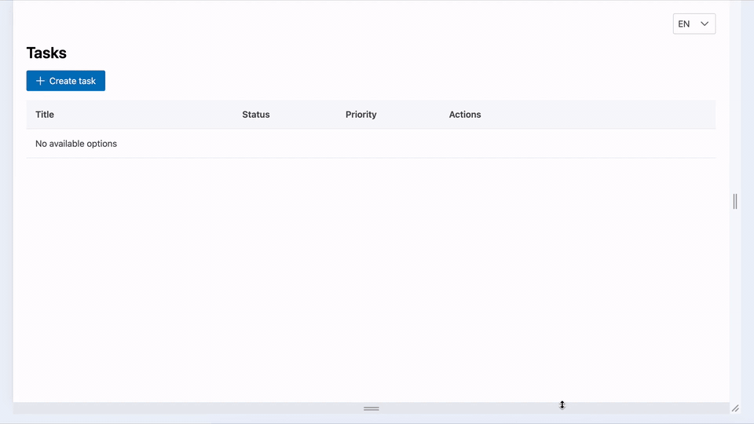

# QA Demo Project - Task Management Application

[](https://openjdk.org/)
[](https://spring.io/projects/spring-boot)
[](https://nodejs.org/)
[](https://reactjs.org/)
[](https://www.typescriptlang.org/)
[](https://www.mongodb.com/)
[](https://kafka.apache.org/)

[](https://vitest.dev/)
[](https://junit.org/junit5/)
[](https://selenide.org/)
[](https://playwright.dev/)
[](doc/testing-guide.md)
<!-- When adding a new E2E framework: add a badge here, a sub-bullet in Tech Stack > Testing Frameworks,
     a new #### section under Running Tests > E2E Tests, and replace the matching placeholder in Project Structure -->

[](doc/testing-guide.md)
[](doc/testing-guide.md)
[](https://sergii-h.github.io/qa-demo/)
[](LICENSE)

A full-stack QA engineering demo project applying the **Testing Pyramid** and **shift-left** methodology.

<p style="text-align: center;">
  
</p>

---

## 📑 Table of Contents

- [Project Overview](#-project-overview)
- [Tech Stack](#-tech-stack)
- [Testing Strategy](#-testing-strategy)
- [CI/CD](#-cicd)
- [Getting Started](#-getting-started)
- [Running Tests](#-running-tests)
- [API Endpoints](#-api-endpoints)
- [Project Structure](#-project-structure)
- [Documentation](#-documentation)

---

## 📋 Project Overview

A full-stack Task Management app used as a testing pyramid demo. The domain is intentionally simple so all complexity lives in the test strategy.

**Task model:** `id` · `title` (unique) · `description` · `status` (TODO/IN_PROGRESS/DONE) · `priority` (LOW/MEDIUM/HIGH) · `createdDate` · `updatedDate`

**Requirements:** [Backend](doc/requirements/back-end/README.md) | [Frontend](doc/requirements/front-end/README.md)

---

## 🏗️ Tech Stack

| Layer | Stack |
|---|---|
| Backend | Java 21 · SpringBoot 3.5.12 · MongoDB 4.4 · Kafka 3.3.2 · WireMock 3.9.2 |
| Frontend | TypeScript 5 · React 18 · PrimeReact 10 · Vite 8 · Node 22 |
| Android | Kotlin · Jetpack Compose · Material 3 · Retrofit + Moshi · ViewModel + StateFlow · Min SDK 26 · Target SDK 35 |
| Unit | JUnit5 + Mockito (BE) · Vitest 4 (FE) · JUnit4 + MockK + Robolectric (Android) |
| Integration | JUnit5 + TestContainers (BE) · Vitest 4 (FE) |
| Contract | Pact — HTTP (FE↔BE + Android↔BE) + Kafka message (notification-service↔BE) |
| E2E | Selenide + JUnit5 + Selenium Grid (Java) · Playwright + TypeScript · Compose UI Test (Android) |
| Mutation | PiTest (BE) · Stryker (FE, on-demand) |
| Performance | k6 |
| Security | CodeQL (SAST) · Dependabot alerts (SCA) · GitHub secret scanning & push protection (platform) |
| Coverage | JaCoCo ≥90% (BE) · Istanbul ≥90% (FE) · Kover ≥90% (Android) |

---

## 🧪 Testing Strategy

```
           /\
          /  \    E2E — Full Stack
         /____\   Smoke tests on real env (P1 happy paths only)
        /      \
       /________\ E2E — FE + Mocked BE (Playwright)
      /          \ User flows — no real BE needed
     /____________\
    /              \ Integration + Contract (Pact)
   /________________\ API integration, consumer-driven contracts
  /                  \
 /____________________\
                        Unit (Vitest, JUnit5)
                        Business logic & component behavior
                        Target: >90% coverage
```

| Layer | Share | Notes |
|---|---|---|
| Unit | ~90% | Business logic, component behavior |
| Integration + Pact | ~7-8% | API integration; Pact decouples FE↔BE verification |
| E2E — Mocked BE | ~1-2% | Fast, no real BE required |
| E2E — Full Stack | <1% | Smoke only — confirms deployment wiring, not business logic |

### E2E Test Suites

Each E2E framework under `e2e/` follows the same three-suite split regardless of language or tool:

| Suite | Tag | Purpose | When to run |
|---|---|---|---|
| Mocked BE | *(no tag)* | Browser-level user flows with mocked backend | Every CI run |
| Accessibility | `@accessibility` | axe-core scans for WCAG violations on key UI states | Every CI run |
| UAT | `@uat` | Single smoke test against the real running app | Every CI run |

The UAT suite is intentionally one test (the most critical happy path). Business logic is already covered by the layers below; UAT exists only to confirm all services are wired together correctly in a real environment.

📚 **Detailed Testing Standards:** See [doc/testing-guide.md](doc/testing-guide.md)

---

## 🔄 CI/CD

GitHub Actions validates every change — see [Actions](https://github.com/sergii-h/qa-demo/actions).

| Workflow | Scope |
|---|---|
| `demo-service` | Backend unit, PiTest mutation, integration — push / PR to `master`, path-filtered |
| `demo-interface` | Frontend unit + integration — push / PR to `master`, path-filtered |
| `demo-android` | Android unit + integration tests — push / PR to `master`, path-filtered |
| `pact-interface` | `demo-interface` consumer contracts, task API provider verify, can-i-merge — push / PR to `master` |
| `pact-notification` | `notification-service` consumer contracts, events provider verify, can-i-merge — push / PR to `master` |
| `pact-android` | `demo-android` consumer contracts, task API provider verify, can-i-merge — push / PR to `master` |
| `e2e-reports` | Publish Allure and Playwright reports to GitHub Pages after all web and Android E2E workflows finish |
| `allure-pages` | Allure reports landing page (`master`) |
| `allure-pages-cleanup` | Remove PR report folder (Allure + Playwright HTML) from GitHub Pages when a PR closes |
| `codeql` | SAST — CodeQL analysis for Java and TypeScript (`master`); SARIF artifacts in workflow runs |

**GitHub platform security** (no repo config): Dependabot alerts (SCA), secret scanning, push protection.

Allure and Playwright HTML reports from E2E runs are published to [GitHub Pages](https://sergii-h.github.io/qa-demo/):

| Trigger | Location | How to find |
|---|---|---|
| Push to `master` | `https://sergii-h.github.io/qa-demo/` | Landing page links to Allure (`{suite}/`) and Playwright HTML (`playwright-html-{suite}/`) |
| Pull request to `master` | `https://sergii-h.github.io/qa-demo/pr/{number}/` | Single PR comment with link after all E2E workflows finish; removed when the PR closes |

Raw Allure results and Playwright HTML reports are also kept as workflow artifacts for 7 days.

---

## 🚀 Getting Started

**Prerequisites:** JDK 21 · Maven 3.9+ · Node 22 (≥22.12.0) · Docker · k6 (performance tests only)

One-time setup:

```bash
docker network create qa-demo-e2e
```

### Run the full application in Docker

Starts backend, frontend, MongoDB, Kafka, and WireMock — open http://localhost:5173 (API at http://localhost:8080/v1/tasks).

```bash
docker compose -f docker/docker-compose/run-application.yml up -d

# Optional: Kafka consumer (processes task events from demo-service)
cd notification-service && mvn spring-boot:run
```

### Run locally for development

Start dependencies in Docker, then run backend and frontend on the host:

```bash
docker compose -f docker/docker-compose/run-application.yml up -d qa-demo-mongo qa-demo-kafka qa-demo-wiremock

cd demo-service && mvn spring-boot:run          # http://localhost:8080/v1/tasks
cd demo-interface && npm install && npm start   # http://localhost:5173

# Optional: custom backend URL for the frontend
VITE_BE_API=http://localhost:8080/v1 npm start
```

---

## 🧪 Running Tests

### Unit & Integration Tests

**Backend** — unit, integration, mutation, coverage: see [demo-service README](demo-service/README.md).

**Frontend** — unit, integration, coverage, Stryker mutation: see [demo-interface README](demo-interface/README.md).

### Pact (Consumer-Driven Contract Tests)

Ephemeral broker per CI run; three consumers (`demo-interface`, `notification-service`, `demo-android`) verified against `demo-service`.

```bash
bash .github/scripts/pact-run-local.sh          # full pipeline (all consumers)
bash .github/scripts/pact-run-local-android.sh  # Android-only pipeline
```

See [doc/pact.md](doc/pact.md) for the step-by-step manual run and broker notes.

### E2E Tests

Each E2E framework has three suites: **Mocked BE** (user flows), **Accessibility** (axe-core), **UAT** (smoke against the real app).

See [Playwright E2E README](e2e/playwright-typescript/README.md) · [Selenide E2E README](e2e/selenide-junit5-selenium-grid/README.md) for setup and run commands.

### Performance Tests (k6)

```bash
k6 run performance/baseline-load.js
```

See [Performance README](performance/README.md) for all scenarios, thresholds, and environment variables.

---

## 🎯 API Endpoints

| Method | Endpoint | Description |
|--------|----------|-------------|
| GET | `/v1/tasks` | Get all tasks |
| GET | `/v1/tasks/{id}` | Get task by ID |
| POST | `/v1/tasks` | Create new task |
| PUT | `/v1/tasks/{id}` | Update task |
| DELETE | `/v1/tasks/{id}` | Delete task |
| GET | `/v1/tasks/isValid/{id}` | Validate task (external service) |

---

## 📁 Project Structure

```
qa-demo/
├── demo-service/              # SpringBoot Backend (Java 21)
│   ├── src/main/java/com/example/demo/
│   │   ├── data/              # Domain models (Task, TaskRequest, TaskEvent)
│   │   ├── TaskController.java
│   │   ├── TaskRepository.java
│   │   ├── TaskEventProducer.java
│   │   └── TaskExternalClient.java
│   └── src/test/java/         # Unit, integration & Pact provider tests
│
├── notification-service/      # Kafka Consumer (Java 21) — Pact message consumer
│
├── demo-interface/            # React Frontend (Vite 8 + Node 22)
│   └── src/
│       ├── components/        # tasksTable · createTaskModal · editTaskModal · infoTaskModal · languageSwitcher
│       ├── locales/           # i18n translations (en · es)
│       ├── interfaces/
│       └── services/          # API service layer
│
├── demo-android/              # Native Android app (Kotlin · Jetpack Compose · Min SDK 26)
│   └── app/src/
│       ├── main/java/com/example/demo/
│       │   ├── data/          # Models + Retrofit API
│       │   ├── repository/    # TaskRepository
│       │   └── ui/            # Compose screens + navigation
│       ├── test/              # JVM unit tests (JUnit4 · MockK · Robolectric) + Pact consumer
│       └── androidTest/java/com/example/demo/e2e/
│           ├── context/       # TaskContext
│           ├── interaction/   # Page objects, steps, validations
│           ├── provider/      # StepProvider · ValidationProvider · SupportProvider
│           ├── support/       # WireMock client · UAT API client
│           └── test/          # Suites + bases (@Uat · @Accessibility)
│
├── e2e/
│   ├── playwright-typescript/          # Playwright + TypeScript
│   │   ├── tests/                      # Domain suites: create-task · edit-task · delete-task · task-info · task-table · translation
│   │   ├── interactions/               # pages · steps · validators
│   │   ├── providers/                  # StepProvider · ValidationProvider · SupportProvider
│   │   ├── support/                    # api · mocks
│   │   ├── context/ · data/ · fixtures/ · decorators/
│   └── selenide-junit5-selenium-grid/  # Selenide + JUnit5 (Java)
│       └── src/test/java/
│           ├── test/                   # spec/ · desktop/ · mobile/ — same domain subdirs per suite
│           ├── interaction/            # page · step · validation
│           ├── provider/
│           └── support/ · context/ · data/ · config/ · extension/ · util/
│
├── performance/               # k6 load & spike scripts
│
├── .github/                   # GitHub Actions workflows · reusable CI actions · Pact scripts
│
├── docker/                    # Docker Compose + Dockerfiles
│
└── doc/                       # Testing guide · ADRs · Requirements
```

---

## 📚 Documentation

| Doc | Contents |
|---|---|
| [Testing Guide](doc/testing-guide.md) | Public checklists, pyramid workflow, definition of done |
| Private testing rules | Detailed FE/BE unit & integration rules — private [`.cursor/rules`](.cursor/rules) submodule; available on request |
| [Pact Guide](doc/pact.md) | Full Pact pipeline, step-by-step manual run, broker notes |
| [Backend README](demo-service/README.md) | Running backend unit, integration, and mutation tests |
| [Frontend README](demo-interface/README.md) | Running frontend unit, integration, and mutation tests |
| [Playwright E2E README](e2e/playwright-typescript/README.md) | Playwright test suites, configuration, and run commands |
| [Selenide E2E README](e2e/selenide-junit5-selenium-grid/README.md) | Selenide test suites, Selenium Grid Docker setup |
| [Performance README](performance/README.md) | k6 scenarios and thresholds |
| [ADR Index](doc/adr/README.md) | Architectural decisions with context and rationale |
| [Backend Requirements](doc/requirements/back-end/README.md) | Epics and user stories |
| [Frontend Requirements](doc/requirements/front-end/README.md) | Epics and user stories (web and mobile) |

---

## 📧 Contact

**[Sergii Holdys](https://github.com/sergii-h)** — QA Engineer  
**Location:** Malaga, Spain  
**LinkedIn:** [sergii-holdys](https://www.linkedin.com/in/sergii-holdys-501798158)  
**Available for:** Remote • Hybrid • On-site  
**Demo Project:** [View on GitHub](https://github.com/sergii-h/qa-demo)

---

## 📄 License

This project is licensed under the MIT License — see the [LICENSE](LICENSE) file for details.
