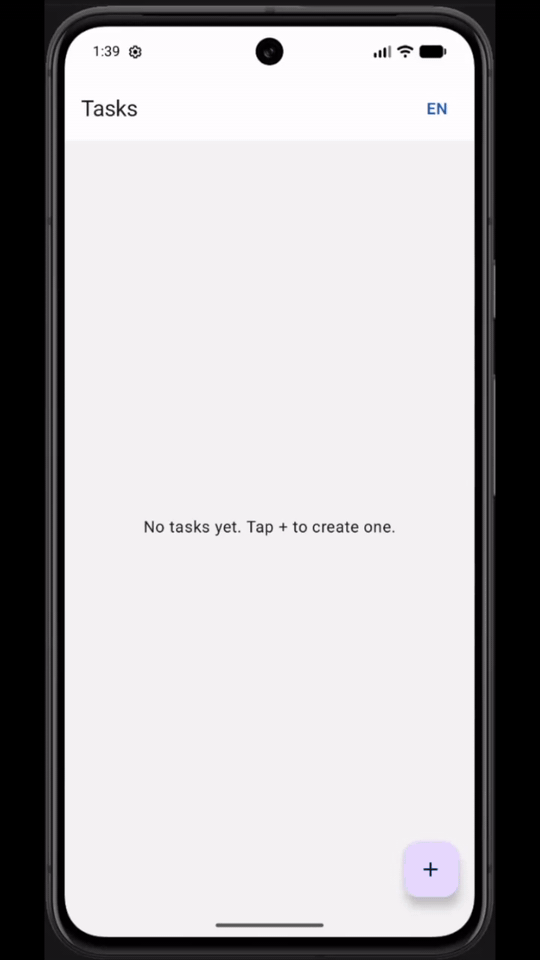

# QA Demo — Android App

Native Android client for the QA Demo task management API. Same CRUD functionality as the React web app, using the existing Spring Boot backend.

<p style="text-align: center;">
  
</p>

**Requirements:** [Frontend requirements](../doc/requirements/front-end/README.md)

## Stack

- Kotlin · Jetpack Compose · Material 3
- Retrofit + Moshi · ViewModel + StateFlow
- Min SDK 26 · Target SDK 35

## Localization

- UI strings: `app/src/main/res/values/strings.xml` (English) and `values-es/strings.xml` (Spanish)
- **EN / ES** switcher on the task list screen (top bar); choice is persisted across restarts
- On first launch, Spanish is used when the device language is `es` / `es-*`; otherwise English (same rule as the web app)

## Features

| Screen | API |
|--------|-----|
| Task list | `GET /v1/tasks` |
| Create task | `POST /v1/tasks` |
| Edit task | `PUT /v1/tasks/{id}` |
| Delete task | `DELETE /v1/tasks/{id}` |
| Task info (+ validation) | `GET /v1/tasks/{id}`, `GET /v1/tasks/isValid/{id}` |

## Prerequisites

1. **Android Studio** (latest stable) with SDK 35 and an emulator or physical device
2. **Backend running** — same as the web app:

```bash
docker compose -f docker/docker-compose/run-application.yml up -d qa-demo-mongo qa-demo-kafka qa-demo-wiremock
cd demo-service && mvn spring-boot:run
```

## Open in Android Studio

1. **File → Open** → select the `demo-android` folder
2. Wait for Gradle sync to finish
3. Create/start an emulator (or connect a device)
4. Click **Run**

## API base URL

Default (Android emulator → host machine):

```properties
http://10.0.2.2:8080/v1/
```

Override in `demo-android/local.properties` (create this file — it is gitignored):

```properties
sdk.dir=/Users/you/Library/Android/sdk
api.base.url=http://10.0.2.2:8080/v1/
```

| Environment | URL |
|-------------|-----|
| Emulator | `http://10.0.2.2:8080/v1/` |
| Physical device (same Wi‑Fi) | `http://<your-mac-ip>:8080/v1/` |

After changing `api.base.url`, rebuild the app.

## Build from CLI

Gradle needs **JDK 17+** on your `PATH` (Android Studio’s bundled JBR is fine). If `java` is not found in the terminal, point `JAVA_HOME` at Android Studio’s runtime:

```bash
export JAVA_HOME="/Applications/Android Studio.app/Contents/jbr/Contents/Home"
export PATH="$JAVA_HOME/bin:$PATH"
```

```bash
cd demo-android
./gradlew test                  # JVM unit tests (no device)
./gradlew pactTest              # Pact consumer contract tests (JUnit 5, separate task)
./gradlew assembleDebug
./gradlew installDebug          # device/emulator connected
```

## Pact (consumer contract tests)

Consumer-driven contracts for the task API, aligned with `demo-interface` and verified by `demo-service` provider tests.

```bash
./gradlew pactTest
# pact files written to app/build/pacts/
```

Publish locally as part of the Android-only pipeline:

```bash
bash ../.github/scripts/pact-run-local-android.sh
```

Or the full pipeline (web + notification-service + Android):

```bash
bash ../.github/scripts/pact-run-local.sh
```

CI runs Android Pact separately via `.github/workflows/pact-android.yml` when `demo-android/**` changes.

Pact tests run on the JVM via a dedicated Gradle task — no emulator. They use JUnit 5 while other unit tests stay on JUnit 4.

## E2E tests (instrumented Compose UI Test)

Mirrors the Playwright web E2E split: mocked-backend flows, accessibility scans, and one full-stack UAT smoke test. Step and validation wiring follows [ADR 005](../doc/adr/005-domain-grouped-step-and-validation-providers-for-e2e.md) (`StepProvider`, `ValidationProvider`).

| Suite | Base class | Backend | When to run |
|-------|------------|---------|-------------|
| Mocked BE | `MockedBackendTestBase` | WireMock on host at `10.0.2.2:8085` | Every CI run |
| Accessibility | `AccessibilityTestBase` (`@Accessibility`) | WireMock on host | Every CI run (API 34+ emulator) |
| UAT | `UatTestBase` (`@Uat`) | Real Spring Boot at `10.0.2.2:8080` | CI with full Docker stack |

**Prerequisites:** emulator or device connected; API 34+ for accessibility checks.

Mocked E2E and accessibility suites call WireMock’s admin API from the instrumented test process and point the app at WireMock via `BuildConfig.API_BASE_URL`. Start WireMock before running those suites:

```bash
docker network create qa-demo-e2e || true
docker compose -f docker/docker-compose/run-application.yml up -d qa-demo-wiremock
```

UAT uses the real backend (see [Prerequisites](#prerequisites) above).

```bash
cd demo-android

# Mocked E2E (create, edit, delete, task info, language)
./gradlew connectedDebugAndroidTest \
  -Papi.base.url=http://10.0.2.2:8085/v1/ \
  -Pandroid.testInstrumentationRunnerArguments.notAnnotation=com.example.demo.e2e.test.base.Uat,com.example.demo.e2e.test.base.Accessibility

# Accessibility (ATF via Compose UI Test — Android equivalent of axe-core)
./gradlew connectedDebugAndroidTest \
  -Papi.base.url=http://10.0.2.2:8085/v1/ \
  -Pandroid.testInstrumentationRunnerArguments.annotation=com.example.demo.e2e.test.base.Accessibility

# UAT smoke test — start backend first (see Prerequisites above)
./gradlew connectedDebugAndroidTest \
  -Pandroid.testInstrumentationRunnerArguments.annotation=com.example.demo.e2e.test.base.Uat
```

Location: `app/src/androidTest/java/com/example/demo/e2e/`

CI: `.github/workflows/android-e2e.yml` (mocked BE, accessibility, UAT in parallel). Allure results are published to [GitHub Pages](https://sergii-h.github.io/qa-demo/) with the web E2E suites.

### Allure report

E2E tests use [allure-kotlin](https://github.com/allure-framework/allure-kotlin) with the same epics, features, TMS links, and step labels as the Selenide mobile tests. Steps use `Allure.step { }` (allure-kotlin does not support AspectJ `@Step` weaving on device). Failed tests attach a screenshot, logcat, and window hierarchy.

Results are written on the device during the run; `connectedDebugAndroidTest` pulls them automatically via `pullAllureResults`.

```bash
cd demo-android

# Run tests (example: mocked E2E) — results land in app/build/allure-results/
./gradlew connectedDebugAndroidTest \
  -Papi.base.url=http://10.0.2.2:8085/v1/ \
  -Pandroid.testInstrumentationRunnerArguments.notAnnotation=com.example.demo.e2e.test.base.Uat,com.example.demo.e2e.test.base.Accessibility

# Generate and open the HTML report locally (requires Allure CLI)
allure generate app/build/allure-results --clean -o app/build/allure-report
allure open app/build/allure-report
```

## Unit tests

- Location: `app/src/test/`
- Stack: JUnit 4, MockK, Truth, Robolectric, coroutines-test, Compose UI Test (`createComposeRule` in `src/test` — no emulator)
- Mutation testing: not used — Android PiTest support is experimental and a poor fit for Robolectric/Compose; Kover line coverage is the quality gate instead (same rationale as Stryker on the web app).

### Coverage

[Kover](https://github.com/Kotlin/kotlinx-kover) on JVM unit tests. `./gradlew test` runs tests and enforces thresholds (90% line, instruction, and branch; 100% per-class line coverage).

Tests + HTML report:

```bash
./gradlew :app:koverHtmlReportDebug
open app/build/reports/kover/htmlDebug/index.html
```

Kover excludes Compose compiler-generated classes (`*Kt$*`, `*ComposableSingletons*`); screen and composable coverage stays in the report.

### Gradle daemon JVM error

If you see `No defined toolchain download url for MAC_OS on aarch64` with `vendor=JetBrains`, remove `gradle/gradle-daemon-jvm.properties` (or regenerate it with `./gradlew updateDaemonJvm` after JDK 17+ is installed). That file pins the Gradle daemon to a JetBrains JDK without download URLs for Apple Silicon.

## Project layout

```
demo-android/
├── app/src/main/java/com/example/demo/
│   ├── data/           # Models + Retrofit API
│   ├── repository/     # TaskRepository
│   └── ui/             # Compose screens + navigation
├── app/src/androidTest/java/com/example/demo/e2e/
│   ├── context/            # TaskContext
│   ├── provider/           # StepProvider, ValidationProvider, SupportProvider
│   ├── interaction/
│   │   ├── page/           # Screen/modal element lookups (Compose page objects)
│   │   ├── step/
│   │   └── validation/
│   ├── support/            # Mock clients, UAT API client
│   │   └── mock/           # WireMockClient, ApiRouteMock, ApiRouteMockClient
│   └── test/               # Scenarios + bases (mirrors Selenide test/)
│       ├── base/           # Bases + suite tags (@Uat, @Accessibility)
│       ├── create/
│       ├── edit/
│       ├── delete/
│       ├── taskinfo/
│       ├── tasktable/
│       └── translation/
└── README.md
```

## Notes

- Cleartext HTTP is allowed for local development (`network_security_config.xml`)
- For production, use HTTPS and restrict cleartext traffic
