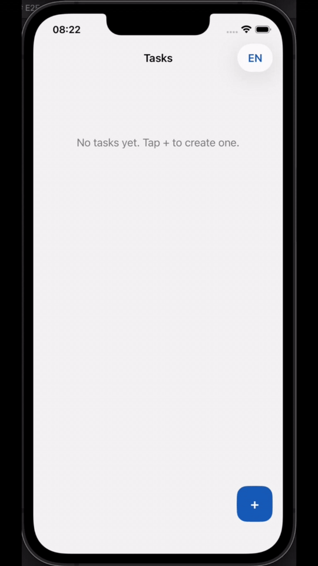

# QA Demo — iOS App

Native iOS client for the QA Demo task management API. Same CRUD functionality as the React web app and Android client, using the existing Spring Boot backend.

<p style="text-align: center;">
  
</p>

**Requirements:** [Frontend requirements](../doc/requirements/front-end/README.md)

## Stack

- Swift · SwiftUI · iOS 17+
- URLSession + Codable · `@Observable` view models + async/await
- Manual constructor injection via protocols (no DI framework)

## Localization

- UI strings: `Demo/Resources/Localizable.xcstrings` (String Catalog — English and Spanish)
- **EN / ES** switcher on the task list screen; choice is persisted across restarts
- On first launch, Spanish is used when the device language is `es` / `es-*`; otherwise English

## Features

| Screen | API |
|--------|-----|
| Task list | `GET /v1/tasks` |
| Create task | `POST /v1/tasks` |
| Edit task | `PUT /v1/tasks/{id}` |
| Delete task | `DELETE /v1/tasks/{id}` |
| Task info (+ validation) | `GET /v1/tasks/{id}`, `GET /v1/tasks/isValid/{id}` |

## Prerequisites

1. **Xcode 16+** with iOS 17 SDK and a simulator (or physical device)
2. **[XcodeGen](https://github.com/yonaskolb/XcodeGen)** — `brew install xcodegen`
3. **Backend running** — same as the web app:

```bash
docker compose -f docker/docker-compose/run-application.yml up -d qa-demo-mongo qa-demo-kafka qa-demo-wiremock
cd demo-service && mvn spring-boot:run
```

## Open in Xcode

```bash
cd demo-ios
xcodegen generate
open Demo.xcodeproj
```

Select an iOS 17+ simulator and click **Run**.

## API base URL

Default (simulator → host machine):

```text
http://localhost:8080/v1/
```

Override via environment variable when launching tests or the app:

```bash
API_BASE_URL=http://localhost:8085/v1/ xcodebuild test ...
```

| Environment | URL |
|-------------|-----|
| Simulator | `http://localhost:8080/v1/` |
| Physical device (same Wi‑Fi) | `http://<your-mac-ip>:8080/v1/` |

## Build and test from CLI

```bash
cd demo-ios
xcodegen generate
bundle install                       # Slather — required for the 90% coverage gate
./Scripts/run-unit-tests.sh          # Swift Testing unit + integration + ViewInspector screen tests
```

Coverage is collected via `xcodebuild -enableCodeCoverage YES` and enforced at **90% line coverage on `Demo.app` only** (`MIN_LINE_COVERAGE` in `Scripts/run-unit-tests.sh`). Test bundles (`DemoTests.xctest`, `DemoPactTests.xctest`) are not part of the gate — Slather reports and `xccov` summaries filter to app source in `Demo/`.

### Run a single test suite

`run-unit-tests.sh` runs every suite in its own `xcodebuild` process (ViewHosting and HTTP stubs are process-global). To run one suite — for example create-task integration tests:

```bash
cd demo-ios
xcodebuild test \
  -project Demo.xcodeproj \
  -scheme Demo \
  -destination "platform=iOS Simulator,name=iPhone 17,OS=latest" \
  -derivedDataPath build/DerivedData \
  -enableCodeCoverage NO \
  -only-testing:DemoTests/CreateTaskIntegrationTests \
  -parallel-testing-enabled NO \
  CODE_SIGNING_ALLOWED=NO
```

Use `-only-testing:DemoTests/<SuiteName>` with any `*Tests.swift` suite under `DemoTests/` (e.g. `EditTaskIntegrationTests`, `TaskListIntegrationTests`, `TaskFormScreenTests`). Integration suites should keep `-parallel-testing-enabled NO`.

Per-test filters (`-only-testing:DemoTests/CreateTaskIntegrationTests/someTestName`) are unreliable with Swift Testing in this project — prefer suite-level filters or run individual tests from the Xcode Test navigator.

## Pact (consumer contract tests)

Consumer-driven contracts for the task API, aligned with `demo-interface`, `demo-android`, and verified by `demo-service` provider tests.

```bash
./Scripts/run-pact-tests.sh
bash Scripts/collect-pacts-from-simulator.sh pacts
```

Publish locally:

```bash
bash ../.github/scripts/pact-run-local-ios.sh
```

CI runs iOS Pact via `.github/workflows/pact-ios.yml` when `demo-ios/**` changes.

Consumer name: `demo-ios`. Provider names per endpoint: `demo-service-tasks-create`, `demo-service-tasks-update`, `demo-service-tasks-delete`, `demo-service-tasks-get-all`, `demo-service-tasks-get-by-id`, `demo-service-tasks-get-is-valid`.

## E2E tests (XCUITest)

Mirrors the Android Compose UI E2E split: mocked-backend flows, accessibility scans, and one full-stack UAT smoke test. Step and validation wiring follows [ADR 005](../doc/adr/005-domain-grouped-step-and-validation-providers-for-e2e.md) (`StepProvider`, `ValidationProvider`).

| Suite | Base class | Backend | When to run |
|-------|------------|---------|-------------|
| Mocked BE | `MockedBackendTestBase` | WireMock at `localhost:8085` | Every CI run |
| Accessibility | `AccessibilityTestBase` | WireMock at `localhost:8085` | Every CI run |
| UAT | `UatTestBase` | Real Spring Boot at `localhost:8080` | Locally with the full Docker stack |

Start WireMock before mocked E2E and accessibility:

```bash
docker network create qa-demo-e2e || true
docker compose -f docker/docker-compose/run-application.yml up -d qa-demo-wiremock
```

```bash
cd demo-ios
xcodegen generate

# Mocked E2E (create, edit, delete, task info, language)
API_BASE_URL=http://localhost:8085/v1/ E2E_SUITE=e2e ./Scripts/run-ui-tests.sh

# Accessibility (identifier and label checks on list, create form, and task info)
API_BASE_URL=http://localhost:8085/v1/ E2E_SUITE=accessibility ./Scripts/run-ui-tests.sh

# UAT smoke test — start the full stack first (see Prerequisites above)
API_BASE_URL=http://localhost:8080/v1/ E2E_SUITE=uat ./Scripts/run-ui-tests.sh
```

Location: `DemoUITests/`

CI: `.github/workflows/ios-e2e.yml` (mocked BE and accessibility in parallel). UAT is not run on GitHub-hosted macOS runners — Docker/Colima cannot start there; run it locally. Allure results are published to [GitHub Pages](https://sergii-h.github.io/qa-demo/) with the other E2E suites.

### Allure report

XCUITest activities (`Allure.step`, epic/feature/TMS labels) are converted from the `.xcresult` bundle into Allure 2 JSON after the run.

```bash
cd demo-ios

API_BASE_URL=http://localhost:8085/v1/ E2E_SUITE=e2e ./Scripts/run-ui-tests.sh

# Generate and open the HTML report locally (requires Allure CLI)
allure generate build/allure-results --clean -o build/allure-report
allure open build/allure-report
```

## Unit tests

| Layer | Framework | Location |
|-------|-----------|----------|
| ViewModel / repository | Swift Testing | `DemoTests/Unit/` |
| Screen (SwiftUI hierarchy) | ViewInspector | `DemoTests/Screen/` |
| Integration (HTTP stub only) | Swift Testing + `URLProtocol` | `DemoTests/Integration/` |
| Contract | PactSwift (XCTest) | `DemoPactTests/` |
| E2E | XCUITest | `DemoUITests/` |

Mutation testing: not used — Muter for Swift is immature; Xcode line coverage is the quality gate (same rationale as Android).

## Project layout

```text
demo-ios/
├── Demo/                    # App — data, repository, UI, locale
├── DemoTests/               # Swift Testing + ViewInspector
├── DemoPactTests/           # PactSwift consumer tests
├── DemoUITests/             # XCUITest E2E
│   ├── Context/             # TaskTestContext
│   ├── Data/                # TaskData, TaskResponse, AllureEpic
│   ├── Interaction/
│   │   ├── Page/            # Screen/modal element lookups
│   │   ├── Step/
│   │   └── Validation/
│   ├── Provider/            # StepProvider, ValidationProvider, SupportProvider
│   ├── Support/Mock/        # WireMockClient, ApiRouteMock
│   └── Test/                # Scenarios + bases
│       ├── Base/            # MockedBackend / UAT / Accessibility
│       ├── Create/
│       ├── Edit/
│       ├── Delete/
│       ├── TaskInfo/
│       ├── TaskTable/
│       └── Translation/
├── Scripts/                 # CI and local test runners
├── project.yml              # XcodeGen spec
└── README.md
```

## Notes

- App Transport Security allows cleartext HTTP for local development
- `Demo.xcodeproj` is generated by XcodeGen — run `xcodegen generate` after cloning or after changing `project.yml`
- Test tags match `demo-android` for cross-platform E2E parity (`page-title`, `add-task-button`, `task-title-{id}`, etc.)
