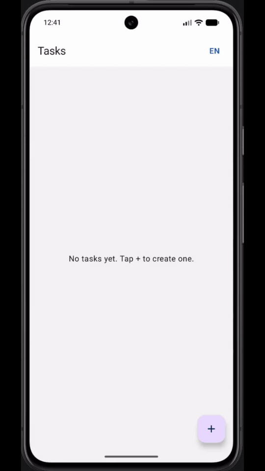

# demo-react-native

React Native · Expo 53 · TypeScript · React Navigation · React Native Paper

Mobile client for the Task Management app. Mirrors `demo-android` functionality against the same `demo-service` REST API.

<p style="text-align: center;">
  
</p>

**Requirements:** [Frontend requirements](../doc/requirements/front-end/README.md)

## Stack

- React Native 0.79 · Expo 53 · TypeScript 5
- React Navigation · React Native Paper · i18next
- Jest · React Native Testing Library

## Localization

- UI strings: `src/locales/en/translation.json` and `src/locales/es/translation.json`
- **EN / ES** switcher on the task list screen (top bar); choice is persisted across restarts
- On first launch, Spanish is used when the device language is `es` / `es-*`; otherwise English

## Features

| Screen | API |
|--------|-----|
| Task list | `GET /v1/tasks` |
| Create task | `POST /v1/tasks` |
| Edit task | `PUT /v1/tasks/{id}` |
| Delete task | `DELETE /v1/tasks/{id}` |
| Task info (+ validation) | `GET /v1/tasks/{id}`, `GET /v1/tasks/isValid/{id}` |

## Prerequisites

- Node 22 (≥22.12.0)
- Expo Go app on a device/emulator, or Android Studio / Xcode for native builds
- **Android SDK `platform-tools`** on `PATH` when using `npm run android` from Cursor or other IDE terminals (Android Studio’s terminal usually has this already):

```bash
export ANDROID_HOME="$HOME/Library/Android/sdk"
export PATH="$ANDROID_HOME/platform-tools:$PATH"
```

Add those lines to `~/.zshrc` if you want them in every shell.
- Backend running — same as the web app:

```bash
docker compose -f docker/docker-compose/run-application.yml up -d qa-demo-mongo qa-demo-kafka qa-demo-wiremock
cd demo-service && mvn spring-boot:run
```

## Running

```bash
npm install
npx expo start --android
```

For the **Android emulator**, run port forwarding once per emulator session so Metro and the API are reachable on `localhost`:

```bash
adb reverse tcp:8081 tcp:8081
adb reverse tcp:8080 tcp:8080
REACT_NATIVE_PACKAGER_HOSTNAME=127.0.0.1 npx expo start --android --localhost
```

`npm run android` is a shortcut for `expo start --android` (opens the app in Expo Go on a running emulator/device).

The API defaults to `http://10.0.2.2:8080/v1/` on Android (emulator → host machine). Override at start time if needed:

```bash
API_BASE_URL=http://10.0.2.2:8080/v1/ npx expo start --android
```

## Tests

```bash
npm test              # unit + integration tests with 90% coverage gate
npm run test:stryker  # mutation tests (on-demand; unit layer, hooks/data/i18n/repository)
npm run test:pact     # Pact consumer contract tests (Vitest, node environment)
```

### Mutation tests (Stryker — on-demand)

Stryker is configured (`stryker.config.json`) but excluded from CI — it is slow and resource-intensive. Run manually when validating assertion quality on the unit-test layer (hooks, API client, repository, error/label mappers).

```bash
npm run test:stryker
open reports/mutation/mutation.html
```

Pact files are written to `pacts/`. Publish locally as part of the React Native pipeline:

```bash
bash ../.github/scripts/pact-run-local-react-native.sh
```

CI runs unit/integration tests via `.github/workflows/demo-react-native.yml` and Pact via `.github/workflows/pact-react-native.yml` when `demo-react-native/**` changes.

## Test layout

| Layer | Suffix | Mock boundary |
|-------|--------|---------------|
| Unit | `.unit.spec.ts(x)` | Repository or child components |
| Integration | `.integration.spec.tsx` | `globalThis.fetch` only |
| Translation | `.translation.spec.tsx` | `i18n.t` spy (real locale JSON files) |
| Pact | `src/test/pact/*.pact.test.ts` | Pact mock server (real `taskApi`) |
